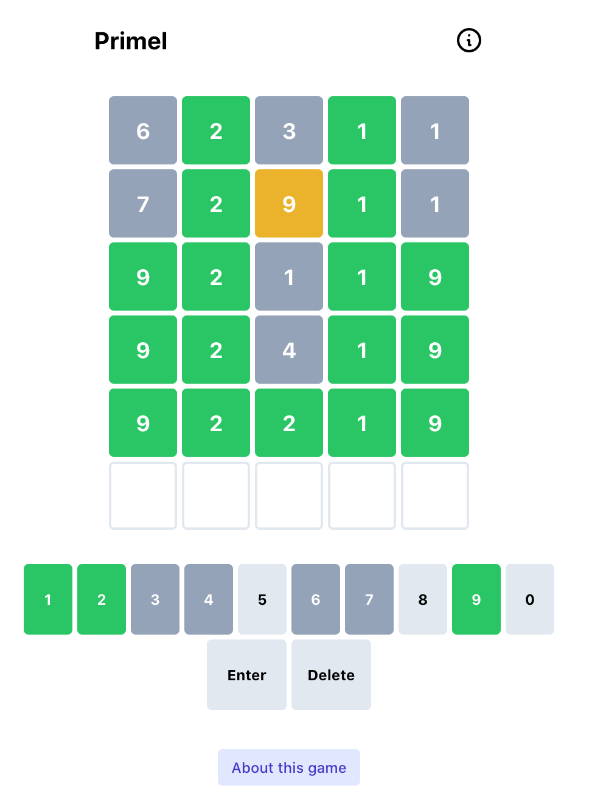

# Primel


Thanks to:
  - [Hannah Park](https://github.com/hannahcode) for creating the [Wordle clone](https://github.com/hannahcode/wordle) that I modified.
  - The list of prime numbers at [UT Martin](https://primes.utm.edu/lists/small/10000.txt).
  - The real Wordle [here](https://www.powerlanguage.co.uk/wordle/)

- Play this [here](https://converged.yt/primel)

# WHAT???!???

In Wordle, you need to guess a 5 letter word. The game lets you know which letters you get right each time you guess a valid word.

In Primel, you need to guess a 5 digit prime. The game lets you know which digits you get right each time you guess a valid 5 digit prime.




_To Run Locally:_
Clone the repository and perform the following command line actions:
```bash
$ cd wordle
$ npm install
$ npm run start
```

